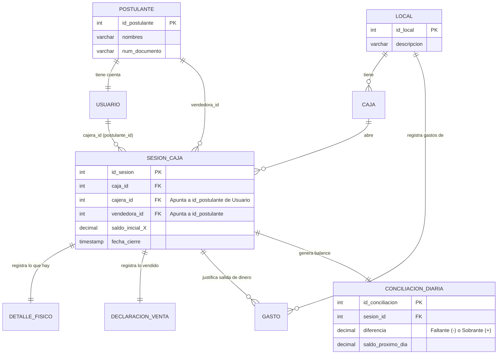
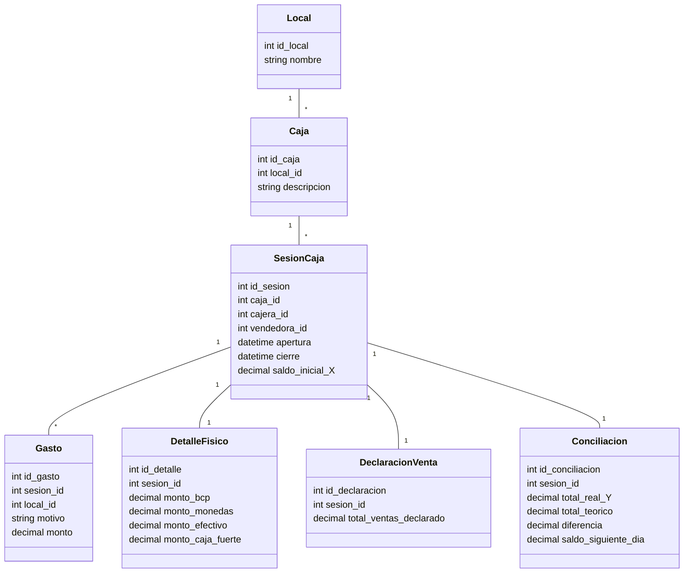
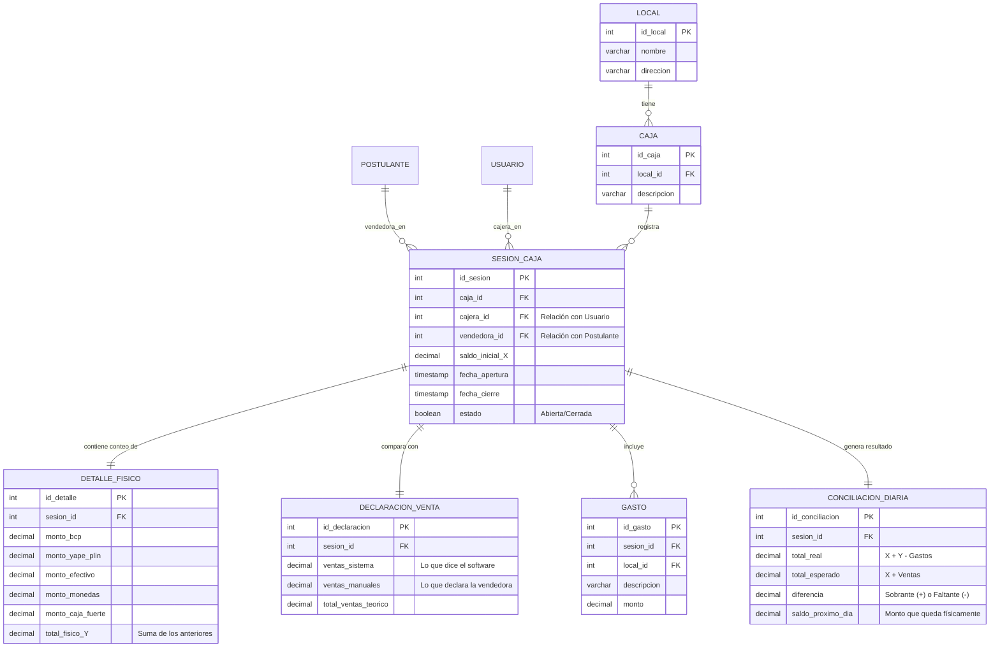
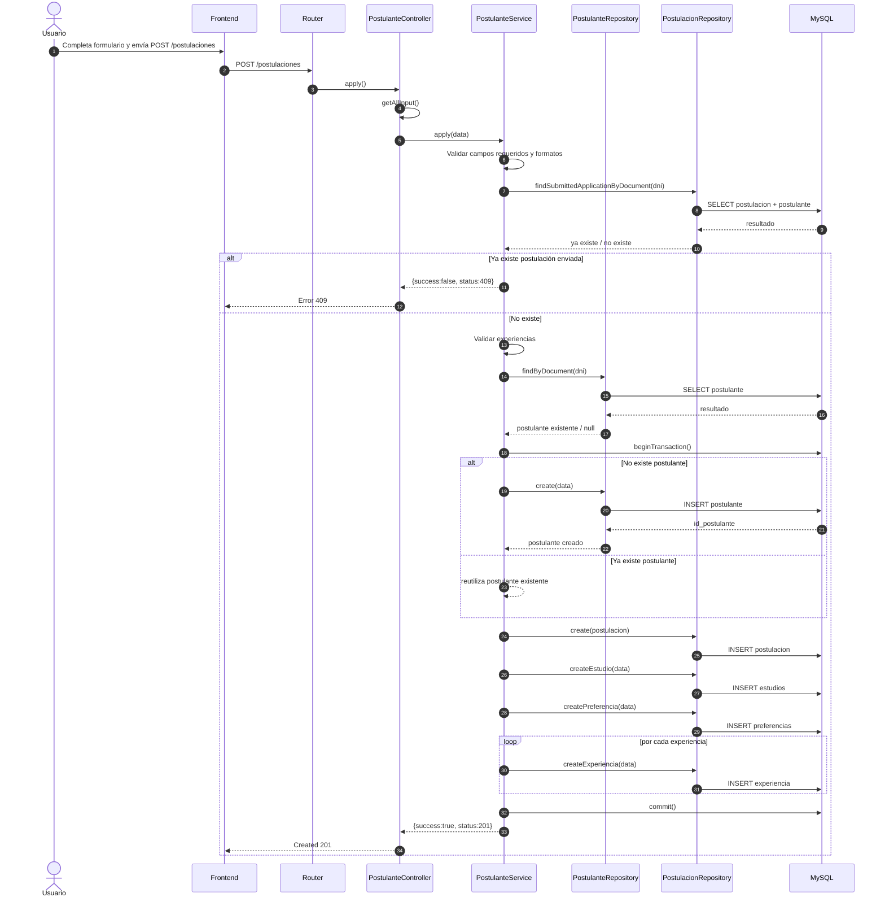
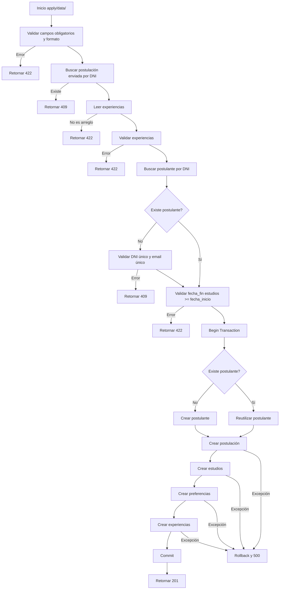
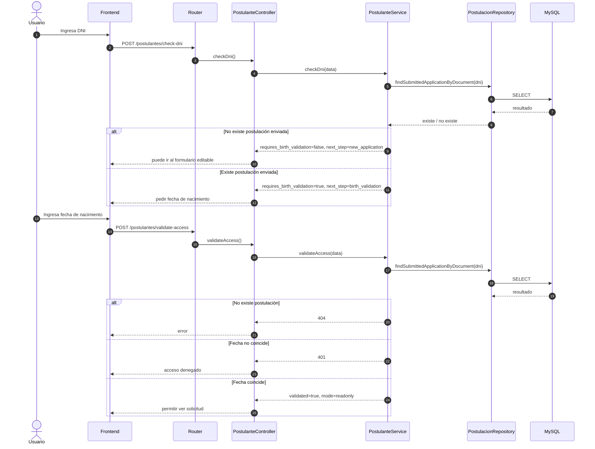
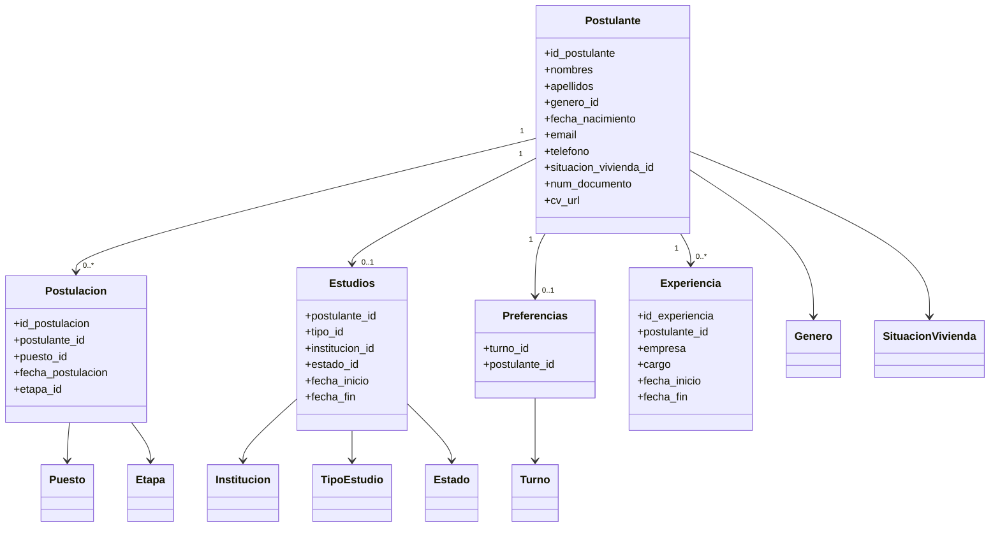
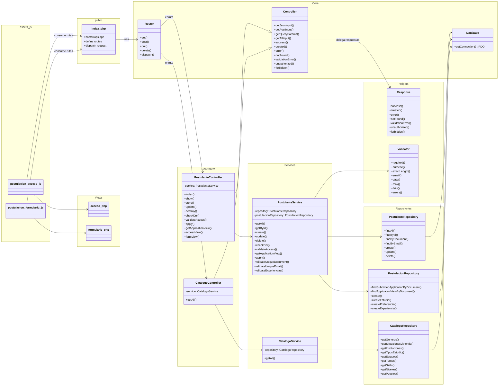

# UML

---

## Diagrama UML de capas

Cliente → Router → Controller → Service → Repository → DB

---

## Diagrama de secuencia: envío de postulación

## Diagrama de actividad: reglas de `apply()`

---

## Diagrama de secuencia: acceso por DNI

## Diagrama UML de dominio / persistencia

## Resumen simple

Si te lo explico en lenguaje directo, tu backend hoy funciona así:

1. **`index.php`** decide qué ruta llegó y la manda al controller correcto. 
2. **El controller** recibe la petición y se la delega al servicio. 
3. **El service** piensa: valida, decide, abre transacción y ordena qué se guarda. 
4. **Los repositories** ejecutan SQL con PDO.
5. **La base de datos** finalmente persiste todo.
6. Si algo falla, el servicio hace rollback y el controller devuelve el error HTTP adecuado.

---

## UML por paquetes del proyecto

## `public`

Aquí vive el punto de entrada del sistema: `index.php`.
Ese archivo registra rutas y llama al router para despachar cada request. Eso se ve en tu estructura actual, donde `index.php` define endpoints como `/postulaciones`, `/catalogos/postulacion`, `/postulantes/check-dni` y similares. 

---

## `Core`

Es la base técnica del proyecto:

- `Router` decide qué controlador y método ejecutar. 
- `Controller` da utilidades comunes para leer input y responder JSON. 
- `Database` crea y reutiliza la conexión PDO. 

Este paquete no sabe nada de “postulaciones”; solo da infraestructura.

---

## `Helpers`

Aquí están las herramientas auxiliares:

- `Response` centraliza el formato de respuesta HTTP.
- `Validator` centraliza reglas como required, date, numeric, max, etc., y es usado fuerte por `PostulanteService`. 

---

## `Controllers`

Son la capa de entrada del backend:

- `PostulanteController` recibe la request, llama al service y convierte el resultado en respuesta HTTP. 
- `CatalogoController` hace lo mismo, pero para catálogos. 

Importante: el controller no mete SQL ni reglas grandes. Eso está bien.

---

## `Services`

Es la capa de negocio:

- `PostulanteService` contiene la lógica real del sistema: validaciones, reglas de negocio, flujo de acceso, creación de postulación, transacción y rollback. 
- `CatalogoService` es más simple: solo arma y devuelve los catálogos. 

---

## `Repositories`

Es la capa que habla con la BD:

- `PostulanteRepository` opera sobre `postulante`. 
- `PostulacionRepository` opera sobre `postulacion`, `estudios`, `preferencias` y `experiencia`. 
- `CatalogoRepository` lee las tablas catálogo. 

---

## `Views` y `assets_js`

Aunque estamos hablando de backend, tu sistema tiene una parte híbrida:

- `acceso.php` y `formulario.php` son vistas simples.
- `postulacion-acceso.js` y `postulacion-formulario.js` consumen los endpoints del backend.

O sea, tu frontend no está separado como SPA independiente; está acoplado de forma ligera al backend PHP.

---

## Mini mapa mental del proyecto

PUBLIC
└── index.php

CORE
├── Router
├── Controller
└── Database

HELPERS
├── Response
└── Validator

CONTROLLERS
├── PostulanteController
└── CatalogoController

SERVICES
├── PostulanteService
└── CatalogoService

REPOSITORIES
├── PostulanteRepository
├── PostulacionRepository
└── CatalogoRepository

VIEWS
├── acceso.php
└── formulario.php

ASSETS/JS
├── postulacion-acceso.js
└── postulacion-formulario.js

---

index.php
   ↓
Router
   ↓
Controller
   ↓
Service
   ↓
Repository
   ↓
Database / MySQL

---